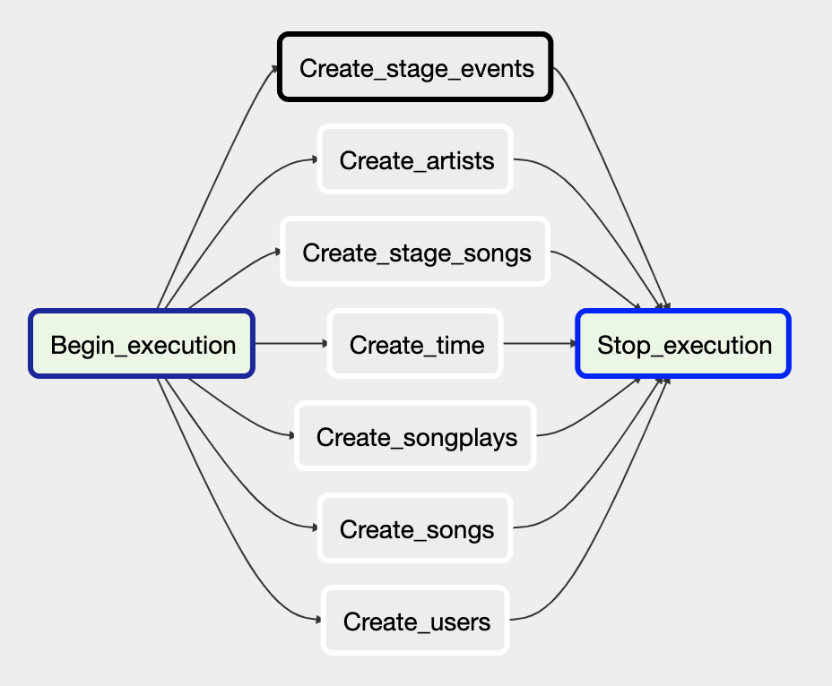

# Sparkify ETL Pipeline

## Project Description

An ETL pipeline built with Apache Airflow, for a fictious music streaming company, Sparkify. The source data resides in S3 and needs to be processed in Sparkify's data warehouse in Amazon Redshift. The source datasets consist of JSON logs that tell about user activity in the application and JSON metadata about the songs the users listen to.

The goal of the project is to create high grade data pipelines that are dynamic and built from reusable tasks, can be monitored, and allow easy backfills. The data quality plays a big part when analyses are executed on top the data warehouse and we want to run tests against the datasets after the ETL steps have been executed to catch any discrepancies in the datasets.

## Pipeline Overview

A first DAG is used to create the tables in Redshift


A second DAG is used for ETL.


## File Structure

```
├── README.md               This file.
├── create_tables.sql       SQL queries for table creation.
├── dags/                   DAG definitions.
├── images/                 Images for documentation.
└── plugins/                Airflow plugins.
    ├── helpers             SQL queries for data insertion.
    └── operators           Airflow custom operators.
```

## Instructions

It is assumed that you have Airflow installed and running. 

Add credentials for Redshift and AWS with ids `redshift` and `aws_credentials` respectively. 

In the Airflow UI, select the "DAGs" tab. Two DAGs should appear. First, run manually the `create_tables_dag`. Once everything runs successfully, turn on the `udac_example_dag`.

## Credits

This is the fifth project in the [Udacity Data Engineer Nanodegree](https://www.udacity.com/course/data-engineer-nanodegree--nd027) and focuses on __Data Pipelines with Airflow__. The SQL quesries and the custom operators skeleton was provided. 
